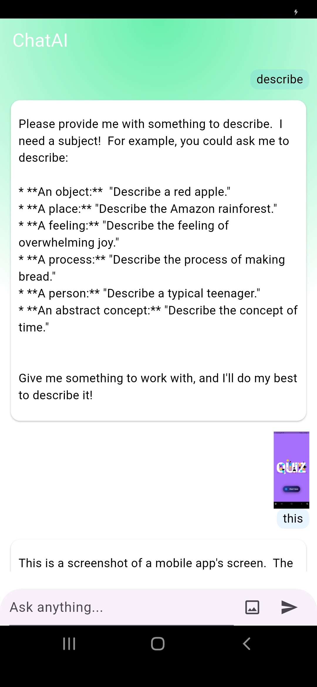
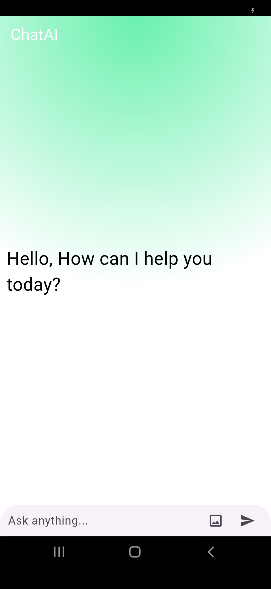

🤖 ChatAi – Ask Anything with AI (Text & Image)

A simple yet powerful Flutter app that lets you interact with Google Gemini AI using both text and images. You can ask questions, upload an image and get instant smart answers from Gemini.

---

  
  

---

✨ Features

    📝 Ask questions via text input
    🖼️ Send images to get visual context answers
    🤖 Integration with Gemini Pro Vision API
    ⚡ Lightweight Flutter UI
    💬 AI answers appear in a clean chat interface

---

🧰 Tech Stack
    Flutter
    Dart
    Google Gemini API (google_generative_ai package)
    Image Picker (image_picker or file_picker)
    HTTP & JSON parsing

---

## 
🧑‍💻 Author

Satya Routray
🌐 [Portfolio](satya-routray.web.app)
